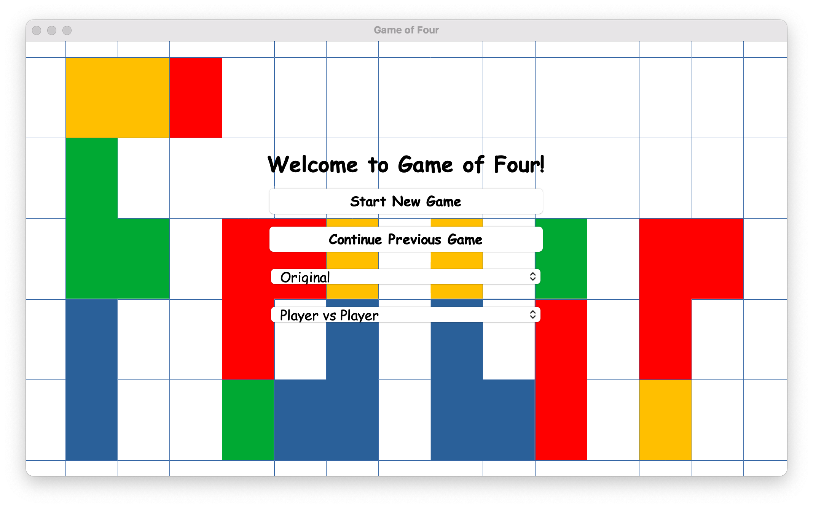
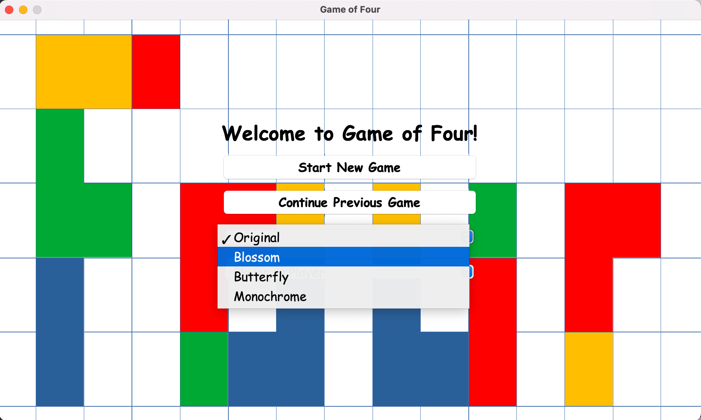
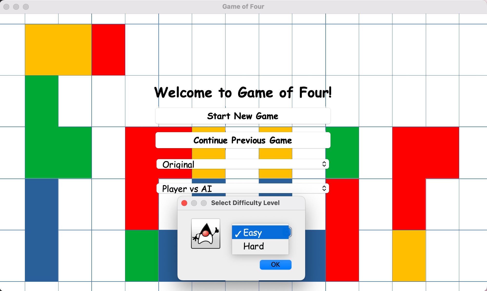
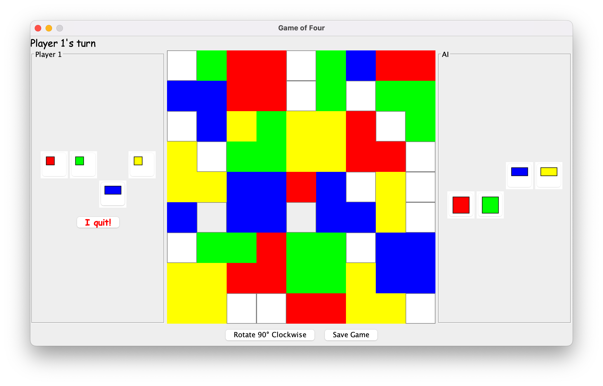

# Game of Four

## Project Overview
Game of Four is a computerized version of Stephen Tavener's Game of Four, developed using Java and Swing. I developed this project in collaboration with my classmates, Adnan Rahman, Adam Jewer, Rana Waleed Aman, and Hamza Zulfiqar for our COMP2005 (Software Engineering) course. 

## Features
- **2 Player Mode**: Play against another person locally.
- **Player vs AI Mode**: Play against the computer in a challenging game of strategy.
- **Different Difficulty Levels**: Choose between easy or hard modes in player vs AI mode.
- **Color Modes for Color Vision Deficiency**: Three additional color modes are available to accommodate players with color vision deficiencies.
- **Save & Load Games**: Save your progress and load previous games to continue where you left off.

## Screenshots
Here are some screenshots of the game in action:


*Home Screen*


*Color Modes*


*Difficulty Modes*


*Gameplay*

## How to Run the Game

1. Clone the repository to your local machine.
   
2. Navigate to the directory containing the `GameOfFour.jar` file.

3. Use the following command to run the game:

   ```bash
   java -jar GameOfFour.jar
